## Buddhabrot

This is a simple Buddhabrot generator, based on Alex Boswell's C++ code
from http://www.steckles.com/buddha/ (circa 2006).

It can render zoomed-in portions of the Buddhabrot, as PPM images.

* To pick your zoom target, edit `main.cpp` and adjust `TargetProperties`.

* To pick your image width and height, edit `main.cpp` and adjust `BitmapProperties`.

* Run `make`, then `./buddha`. It will run forever, periodically overwriting
    the files `red.pgm`, `green.pgm`, `blue.pgm`, and `color.ppm` in the
    current directory.

----

</img>

To reproduce the above image, very similar to [Wikipedia's "Nebulabrot,"](https://commons.wikimedia.org/wiki/File:Nebulabrot_(5000,_500,_50).png)
run the `Classic` method with target `{-0.4, 0, 0.32}` and bitmap `{ 4096, 4096 }`
for as long as you can tolerate, and then tweak its color levels like this:

    convert color.ppm -normalize -level '0,90%' -gamma 0.3 -scale 400x400 nebulabrot.jpg

### Metropolis–Hastings versus Classic

You can also edit `main.cpp` to switch from `RenderBuddhabrotMetro()` to
`RenderBuddhabrotClassic()`.

The classic method simply picks points at random
from the whole disk and graphs their trajectories. Its advantage is that it
produces a really correct image. Its disadvantage is that when you zoom into
a small target, the vast majority of random points will never affect any pixels
in the view window at all.

The Metropolis–Hastings method (based on code and math originally by Alex Boswell)
begins by selecting a small population of points whose trajectories cross the
the view window at least once. Then, it produces new points by mutating the
existing population — jiggling these points by small amounts, and discarding them
if the jiggles cause them to fall out of the view window. Finally, it introduces
new random points fairly often, to reduce the effects of getting "stuck" in one
area of the disk and never exploring other areas. Its advantage is that it works
great for zooming into a small target. Its disadvantage is that it produces
artificially high-contrast images.

Note the visual difference between images generated with the classic algorithm
and the Metropolis–Hastings algorithm. Each image is the result of evaluating
trajectories for one million candidate points, with `bitmap = {640, 480}`.
The first row uses `target = {-0.4, 0, 0.32}`; the second row uses
`target = {-0.657560793, 0.467732884, 70.5}` (i.e. `target5`).

| Classic | Metro, 100% replacement | Metro, 50% replacement | Metro, 33% replacement | Metro, 25% replacement | Metro, 20% replacement |
|:-----:|:-----:|:-----:|:-----:|:-----:|:-----:|
| 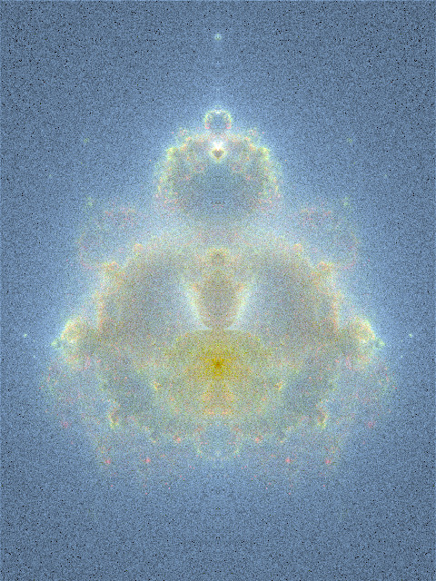 | 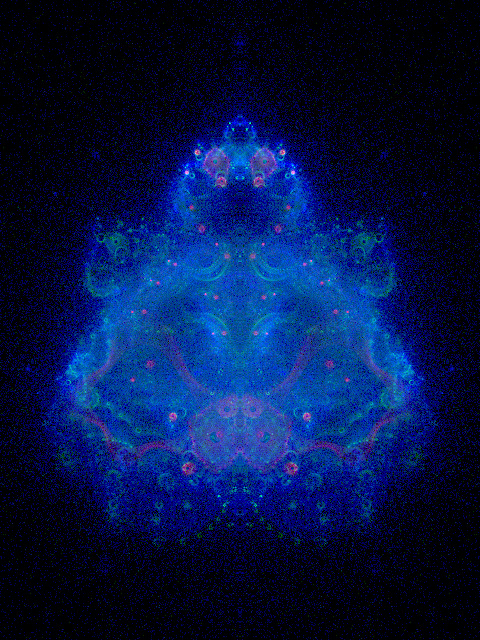 | 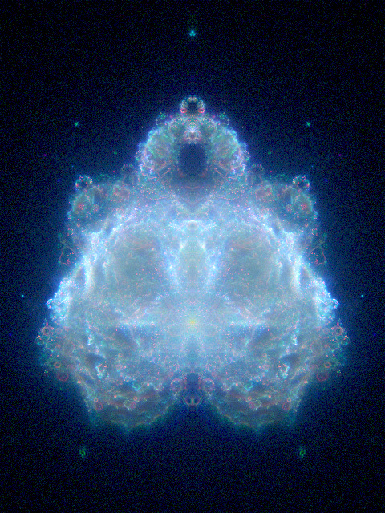 | 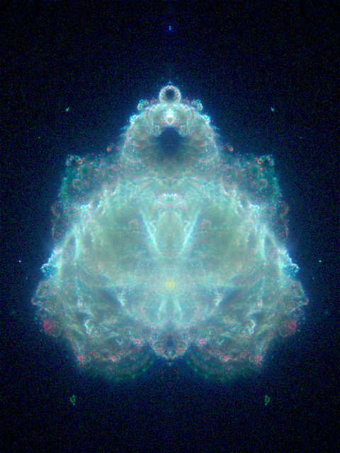 | 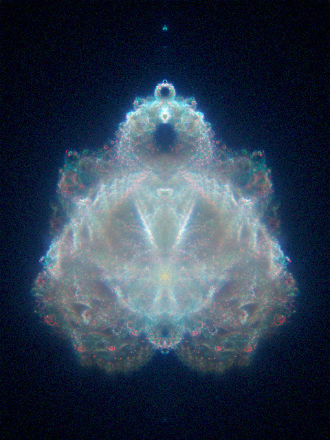 | 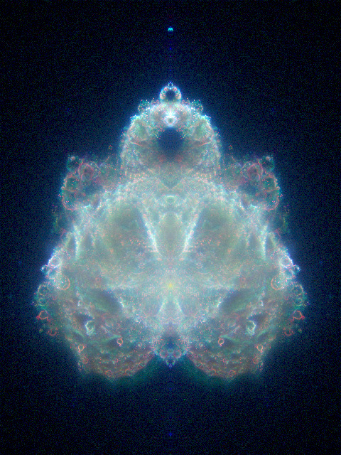 |
| 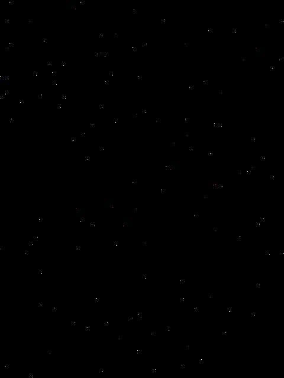 |  | 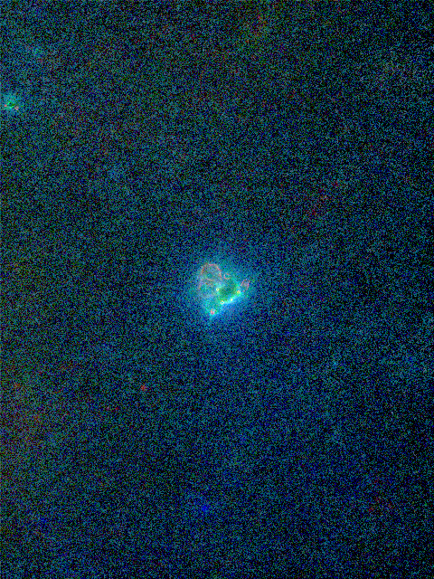 | 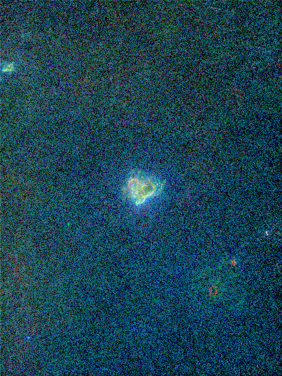 | 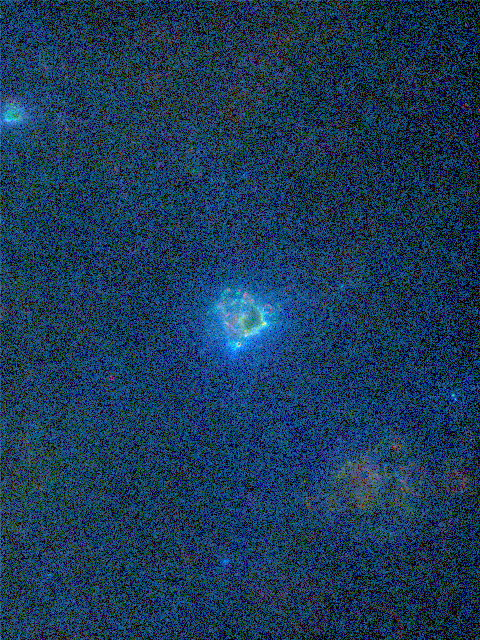 | 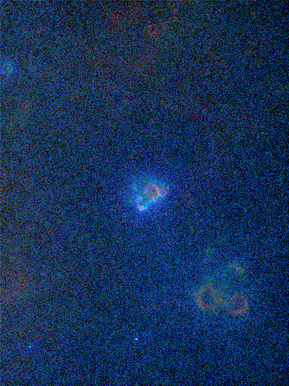 |

[Benedikt Bitterli](https://benedikt-bitterli.me/buddhabrot/) describes a perhaps
more mathematically sound approach using "importance maps" (which are interesting
visualizations in themselves), but this repository doesn't contain any code related
to that approach.

### Other renderers

Other (and perhaps better) Buddhabrot renderers include:

* [dllu/puppybrot](https://github.com/dllu/puppybrot) (png++, no zooming)

### See also

* [Melinda Green's site](https://superliminal.com/fractals/bbrot/): the discoverer of Buddhabrot

* [Alex Boswell's site](http://www.steckles.com/buddha/), with info on Metropolis–Hastings

* [Benedikt Bitterli's site](https://benedikt-bitterli.me/buddhabrot/), with info on importance maps
    and some high-resolution images (for example: [3840x2160, 5.6MB .png](https://benedikt-bitterli.me/buddhabrot/images/denoised-full.png))
